# Plugin Architecture

How Magellon plugins work end-to-end: from `PluginBase` on the backend to the React plugin runner and image-viewer integrations on the frontend. Uses the `pp/template-picker` (particle picking) plugin as the running example.

- [1. High-level picture](#1-high-level-picture)
- [2. Backend: the plugin contract](#2-backend-the-plugin-contract)
- [3. Backend: discovery and router mounting](#3-backend-discovery-and-router-mounting)
- [4. Backend: job service + Socket.IO](#4-backend-job-service--socketio)
- [5. Backend: the `pp` particle-picking plugin](#5-backend-the-pp-particle-picking-plugin)
- [6. Frontend: the plugin runner page](#6-frontend-the-plugin-runner-page)
- [7. Frontend: image-viewer integration](#7-frontend-image-viewer-integration)
- [8. End-to-end flows (sequence diagrams)](#8-end-to-end-flows-sequence-diagrams)
- [9. Data shapes cheat sheet](#9-data-shapes-cheat-sheet)
- [10. File index](#10-file-index)

---

## 1. High-level picture

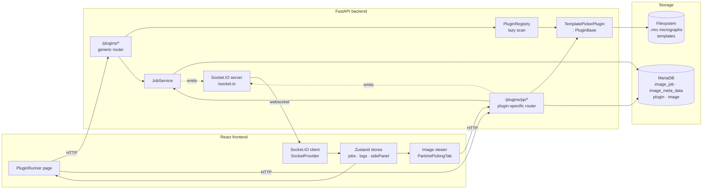

Every plugin is built the same way:

1. A Python class that inherits `PluginBase[InputT, OutputT]` and implements `execute()`.
2. A `service.py` module so the registry can find it by filename convention.
3. Optionally, a plugin-specific FastAPI router (like `pp/controller.py`) for endpoints the generic `/plugins/{id}/jobs` contract can't express — preview/retune flows, batch jobs, DB persistence variants.
4. Frontend code that either drops into the generic `PluginRunner` page (schema-driven form) or embeds the plugin into a richer feature (the particle-picking tab in the image viewer).

---

## 2. Backend: the plugin contract

Every plugin subclasses `PluginBase` — a generic abstract class parameterised by its input and output Pydantic models.

**File:** `CoreService/plugins/base.py`

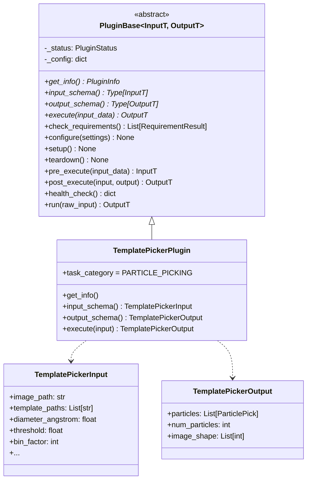

Only `get_info`, `input_schema`, `output_schema`, and `execute` are required. Everything else has a default. The top-level entry point is `run(raw_input)` which orchestrates the pipeline:

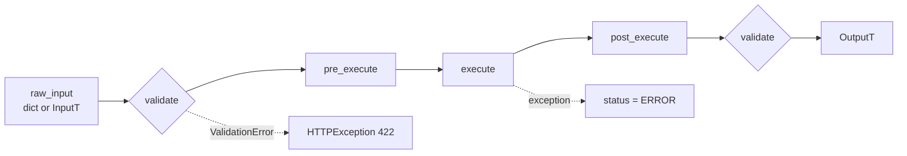

`PluginStatus` tracks lifecycle: `DISCOVERED → INSTALLED → CONFIGURED → READY → RUNNING → COMPLETED/ERROR → DISABLED`.

---

## 3. Backend: discovery and router mounting

### Discovery

**File:** `CoreService/plugins/registry.py`

The registry is a lazy singleton. Nothing is loaded at import time; the first call to `registry.list()` or `registry.get(plugin_id)` triggers a filesystem scan under `plugins/` for modules named `*.service`. For each hit, the module is imported, scanned for `PluginBase` subclasses, and one instance is cached.

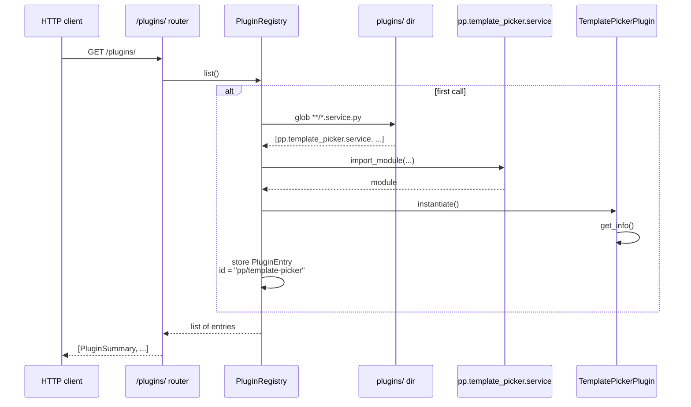

Plugin id format: `{category}/{info.name}`, where `category` is the directory directly under `plugins/` (e.g. `pp`) and `info.name` comes from `get_info()`.

### Router mounting

**File:** `CoreService/main.py` (lines 49–50, 303–304, 322)

Two routers mount, plus Socket.IO:

| Path prefix | Router | Purpose |
|---|---|---|
| `/plugins` | `plugins_router` | Generic contract: list, info, schema, submit, jobs |
| `/plugins/pp` | `pp_router` | Plugin-specific endpoints for particle picking |
| `/socket.io` | `sio` ASGI app | Real-time job progress + logs |

The generic router is enough to run any plugin — the plugin-specific one adds endpoints the generic contract can't express cleanly (preview/retune, DB-image run-and-save, batch).

---

## 4. Backend: job service + Socket.IO

Async plugins don't block the HTTP request. They return a **job envelope** immediately; actual execution runs in `asyncio.create_task(...)` and streams progress via Socket.IO.

### JobService

**File:** `CoreService/services/job_service.py`
**Table:** `image_job` (+ `image_job_task` per image)

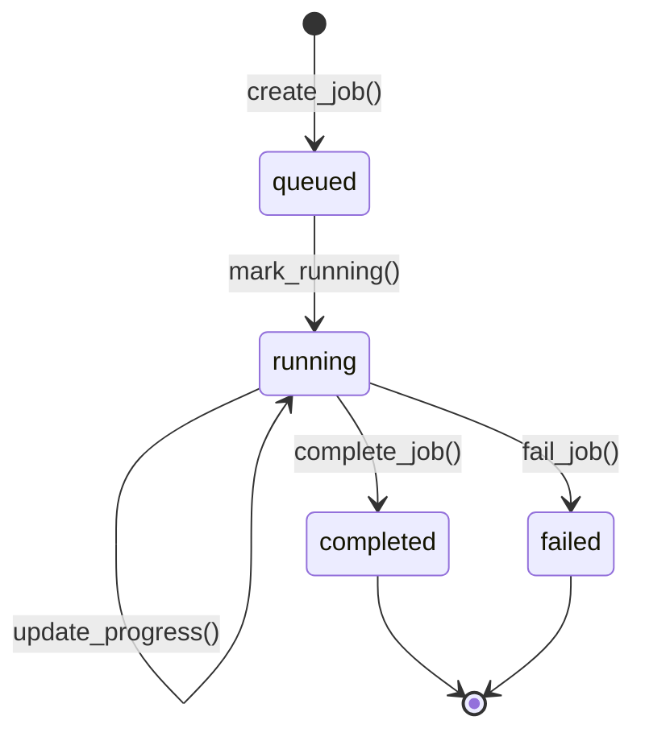

Envelope shape (same for every call that returns a job):

```json
{
  "job_id": "<uuid>",
  "plugin_id": "pp/template-picker",
  "name": "Particle Picking",
  "status": "queued|running|completed|failed",
  "progress": 0,
  "num_items": 0,
  "started_at": null,
  "ended_at": null,
  "error": null,
  "settings": { "...input params..." },
  "result": { "...only on completion..." }
}
```

### Socket.IO

**File:** `CoreService/core/socketio_server.py`

Two events, both emitted from the backend:

| Event | Emitter | Payload | Listener |
|---|---|---|---|
| `job_update` | `emit_job_update(sid, envelope)` | Job envelope (as above) | `SocketProvider` → `useJobStore` |
| `log_entry` | `emit_log(level, source, message)` | `{ id, timestamp, level, source, message }` | `SocketProvider` → `useLogStore` |

When the frontend submits a job it passes its connection's `sid` as a query param; the backend scopes emits to that room so only the submitter sees progress.

---

## 5. Backend: the `pp` particle-picking plugin

Directory: `CoreService/plugins/pp/`

```
plugins/pp/
├── controller.py          FastAPI router at /plugins/pp
├── models.py              Pydantic: TemplatePickerInput/Output, BatchPickRequest, ...
└── template_picker/
    ├── service.py         TemplatePickerPlugin : PluginBase
    └── algorithm.py       FFT correlation, peak extraction, merging
```

### Endpoint map

| Endpoint | Sync/Async | Saves to DB? | Use case |
|---|---|---|---|
| `POST /template-pick` | sync | no | Stateless; used by the plugin runner and by the fallback path when no DB image is selected. |
| `POST /template-pick/preview` | sync | no (TTL cache) | Runs the expensive FFT once; returns `preview_id`, initial picks, and a score-map thumbnail. |
| `POST /template-pick/preview/{id}/retune` | sync | no | Re-thresholds the cached maps — fast param sweeps with no recompute. |
| `DELETE /template-pick/preview/{id}` | sync | — | Evict from the 10-minute TTL cache. |
| `POST /template-pick-async` | async | `image_job` row only | Generic async job with Socket.IO progress. |
| `POST /template-pick/run-and-save` | async | `image_meta_data` row | Run on a DB image and persist particles so the picking-record dropdown finds them. |
| `POST /template-pick/batch` | async | one `image_meta_data` row per image | Many images, one job, templates preprocessed once. |
| `GET /template-pick/records/{ipp_oid}/coco` | sync | no | Export a saved picking record as COCO JSON. |
| `GET /template-pick/session-images` | sync | no | List candidate images for batch selection, filtered by magnification. |
| `GET /template-pick/schema/{input,output}` | sync | no | JSON schema introspection (used by the plugin runner's form). |

### Persistence model for particle picks

Each saved picking record is a row in `image_meta_data` with `type=5` and `plugin_id` pointing to the `plugin` row whose `name='pp'`.

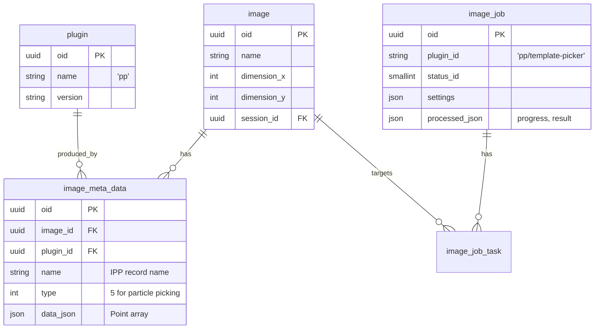

The `Point` array inside `data_json`:

```json
[
  { "x": 1024, "y": 512, "id": "auto-...-0",
    "type": "auto", "confidence": 0.87, "class": "1", "timestamp": 1742000000 },
  ...
]
```

`class` is the id of the frontend particle class (`1=Good, 2=Edge, 3=Contamination, 4=Uncertain`). For auto-picks the controller assigns `class=1` when `score ≥ threshold` and `class=4` otherwise.

### COCO export

`GET /plugins/pp/template-pick/records/{ipp_oid}/coco?radius=<r>` loads the record, joins to `image`, and emits a COCO annotation JSON. Circles are represented as square bboxes (`[cx-r, cy-r, 2r, 2r]`, `area=πr²`, empty segmentation) with non-standard `score`, `pick_type`, `radius` keys preserved for round-trips — the convention used by crYOLO/Topaz converters.

---

## 6. Frontend: the plugin runner page

**File:** `magellon-react-app/src/features/plugin-runner/ui/PluginRunner.tsx`

Purpose: a generic page that can run *any* registered plugin without writing plugin-specific UI. The form is built from the plugin's input schema.

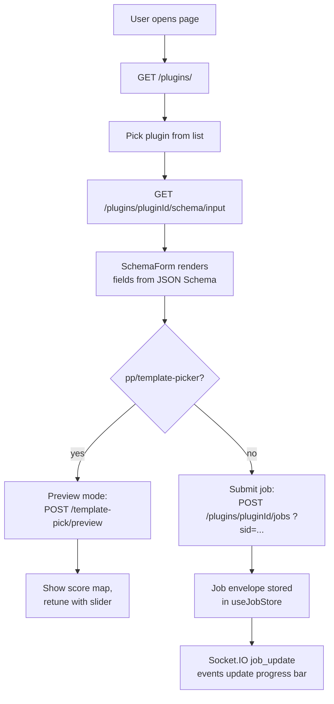

### Schema-driven forms

**File:** `magellon-react-app/src/features/plugin-runner/ui/SchemaForm.tsx`

Pydantic models add UI hints via `Field(json_schema_extra={...})`. The form reads those hints to pick a widget.

| `ui_widget` | Widget |
|---|---|
| `slider` | MUI Slider with `ui_step`, `ui_marks`, `ui_unit` |
| `number` | TextField type=number |
| `toggle` | Switch |
| `select` | Select with options |
| `file_path` / `file_path_list` | Custom file picker dialog |
| `hidden` | Not rendered (caller fills it, e.g. `image_path`) |

Other keys: `ui_group` (accordion section), `ui_order` (sort within group), `ui_advanced` (collapse under "Advanced"), `ui_tunable` (whether retune supports this field).

---

## 7. Frontend: image-viewer integration

The image viewer doesn't use the generic plugin runner — it embeds `pp/template-picker` in a richer UI (canvas, stats sidebar, undo/redo, manual picks, batch dialog).

**Key files:**

- `features/image-viewer/ui/ParticlePickingTab.tsx` — page layout, class definitions, snackbar.
- `features/image-viewer/ui/ParticleToolbar.tsx` — top bar: picking-record dropdown, tool toggles, zoom, export.
- `features/image-viewer/ui/ParticleCanvas.tsx` — SVG canvas with particles.
- `features/image-viewer/ui/ParticleSettingsDrawer.tsx` — settings panel content (rendered in the app side panel).
- `features/image-viewer/ui/BatchRunDialog.tsx` — session-scoped batch.
- `features/image-viewer/lib/useParticleOperations.ts` — all the state + backend calls.

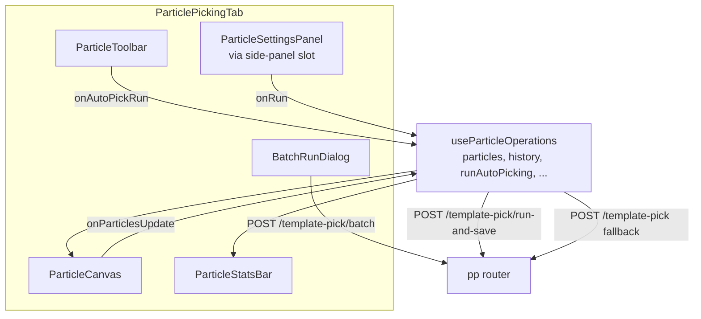

### Side-panel slot

The settings UI isn't rendered inside the tab — it's *registered* into a global slot (`useSettingsPanelSlot.setContent(...)`) and the app-level `SidePanelArea` renders whichever content is registered when `useSidePanelStore.activePanel === 'settings'`. This is the same mechanism Jobs and Logs use.

### `useParticleOperations` — the central hook

| Field | What it holds |
|---|---|
| `particles` | Current pick list (Point[]) |
| `history` + `historyIndex` | Undo/redo stack |
| `selectedParticles` | Set of selected Point ids |
| `imageShape` | `[height, width]` from backend so canvas sizes its viewBox correctly |
| `stats` | Counts per class, manual/auto split, avg confidence |
| `isAutoPickingRunning`, `autoPickingProgress` | UI progress state |

The hook's `runAutoPicking()` branches on whether the image is in the DB:

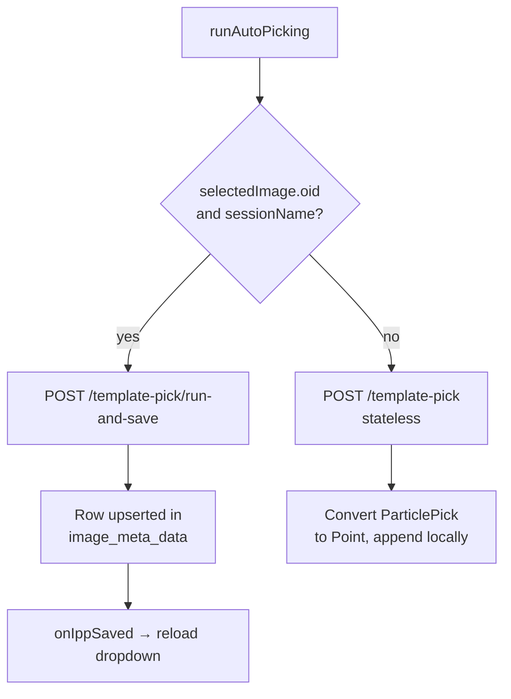

---

## 8. End-to-end flows (sequence diagrams)

### 8.1 Auto-pick on a DB image (run-and-save)

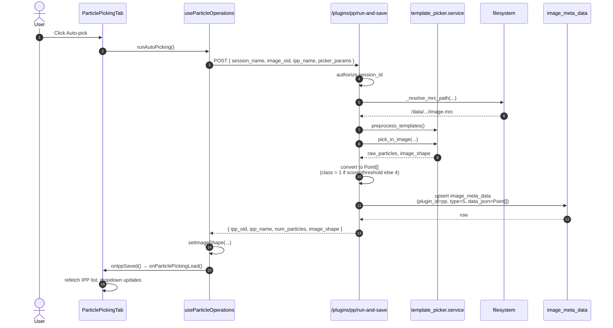

No Socket.IO here — it's a single HTTP round-trip. The frontend sees progress ticks (10% → 40% → 70% → 100%) that `runAutoPicking()` sets locally as milestones, not from the server.

### 8.2 Batch run across a session (Socket.IO progress)

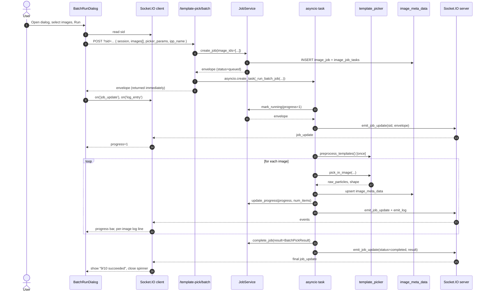

### 8.3 Preview / retune on the plugin runner page

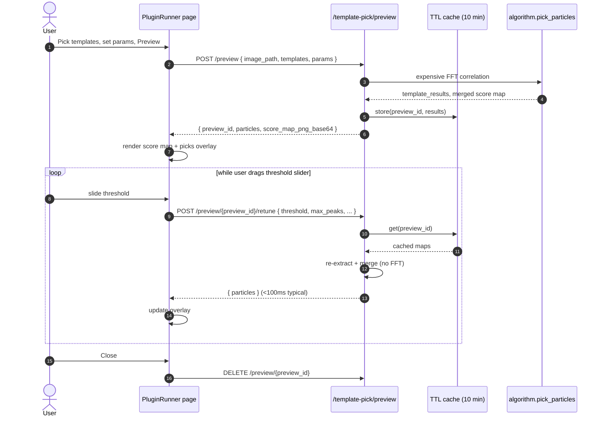

---

## 9. Data shapes cheat sheet

### Job envelope (Socket.IO + HTTP)
```json
{
  "job_id": "uuid",
  "plugin_id": "pp/template-picker",
  "status": "queued|running|completed|failed",
  "progress": 0,
  "num_items": 0,
  "settings": { "...": "..." },
  "result": { "...": "..." }
}
```

### Log entry
```json
{
  "id": "log-1742000000000",
  "timestamp": "10:30:45",
  "level": "info|warning|error",
  "source": "batch-picking",
  "message": "[3/10] image_003.mrc: done (142 particles)"
}
```

### Point (frontend + `data_json`)
```json
{
  "x": 1024,
  "y": 512,
  "id": "auto-1742000000000-0",
  "type": "manual|auto|suggested",
  "confidence": 0.87,
  "class": "1",
  "timestamp": 1742000000000
}
```

### COCO annotation (export)
```json
{
  "id": 1,
  "image_id": 1,
  "category_id": 1,
  "bbox": [1009.0, 497.0, 30.0, 30.0],
  "area": 706.858,
  "segmentation": [],
  "iscrowd": 0,
  "score": 0.87,
  "pick_type": "auto",
  "radius": 15.0
}
```

---

## 10. File index

### Backend

| Concern | File |
|---|---|
| Plugin base class | `CoreService/plugins/base.py` |
| Plugin registry | `CoreService/plugins/registry.py` |
| Generic router | `CoreService/plugins/controller.py` |
| `pp` router | `CoreService/plugins/pp/controller.py` |
| `pp` Pydantic models | `CoreService/plugins/pp/models.py` |
| `pp` algorithm | `CoreService/plugins/pp/template_picker/service.py`, `algorithm.py` |
| Job service | `CoreService/services/job_service.py` |
| Socket.IO server | `CoreService/core/socketio_server.py` |
| SQLAlchemy models | `CoreService/models/sqlalchemy_models.py` (`Image`, `ImageMetaData`, `ImageJob`, `Plugin`) |
| Plugin enums / info | `CoreService/models/plugins_models.py` (`PluginStatus`, `TaskCategory`, `PluginInfo`) |
| ASGI mount points | `CoreService/main.py` |

### Frontend

| Concern | File |
|---|---|
| Plugin runner page | `magellon-react-app/src/features/plugin-runner/ui/PluginRunner.tsx` |
| Plugin API client | `magellon-react-app/src/features/plugin-runner/api/PluginApi.ts` |
| Schema-driven form | `magellon-react-app/src/features/plugin-runner/ui/SchemaForm.tsx` |
| Particle picking tab | `magellon-react-app/src/features/image-viewer/ui/ParticlePickingTab.tsx` |
| Particle operations hook | `magellon-react-app/src/features/image-viewer/lib/useParticleOperations.ts` |
| Batch run dialog | `magellon-react-app/src/features/image-viewer/ui/BatchRunDialog.tsx` |
| Particle toolbar | `magellon-react-app/src/features/image-viewer/ui/ParticleToolbar.tsx` |
| Socket.IO provider | `magellon-react-app/src/shared/lib/SocketProvider.tsx`, `useSocket.ts` |
| Job store | `magellon-react-app/src/app/layouts/PanelLayout/useJobStore.ts` |
| Side-panel stores | `magellon-react-app/src/app/layouts/PanelLayout/useBottomPanelStore.ts`, `useSettingsPanelSlot.ts` |

### Related docs

- `CoreService/docs/plugin-developer-guide.md` — how to write a new plugin step-by-step.
- `CoreService/docs/architecture/EVENT_ARCHITECTURE.md` — broader Socket.IO event catalogue.
- `CoreService/docs/architecture/WORKFLOW_ARCHITECTURE.md` — pipeline/workflow orchestration (supersedes single-plugin jobs).
