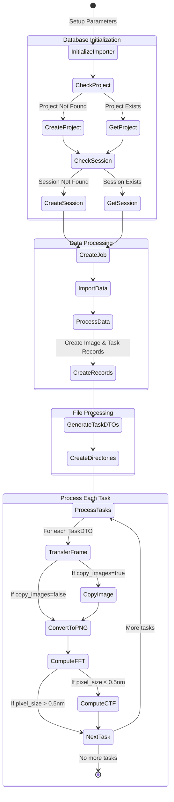

# Microscopy Data Import Process Documentation

## Overview
The import process handles microscopy session data import into the system, managing both database records and file processing. It follows a structured pipeline that ensures data consistency and proper file handling.

## Process Flow

### 1. Database Initialization
- Creates or retrieves Project record if project name is provided
- Creates or retrieves Session record if session name is provided 
- Creates a new Job record to track the import process

### 2. Data Processing
- Imports raw data from source system
- Processes imported data into system-compatible format
- Creates Image records and JobTask records in database
- Generates TaskDTOs for file processing

### 3. File Processing
- Creates required directory structure for:
  - Original images
  - Frames
  - FFT images
  - Thumbnails
  - Atlas images
  - CTF data

### 4. Task Execution
For each TaskDTO:
- Transfers frame files if they exist
- Copies original images if specified
- Converts images to PNG format
- Computes FFT (Fast Fourier Transform)
- Triggers CTF (Contrast Transfer Function) computation for qualifying images

## Activity Diagram



## Key Components

### BaseImporter Class
Abstract base class defining the core import pipeline with following key methods:
- `setup()`: Initializes basic parameters
- `setup_data()`: Handles type-specific initialization
- `import_data()`: Imports data from source system
- `process_imported_data()`: Processes imported data
- `get_image_tasks()`: Retrieves list of processing tasks
- `process()`: Orchestrates the entire import process

### Task Processing
Each task processes the following:
1. Frame file transfer
2. Original image copying (optional)
3. PNG conversion
4. FFT computation
5. CTF computation (for images with pixel size ≤ 0.5nm)

### Exception Handling
Implements hierarchical exception handling:
- `ImportError`: Base exception for import process
- `TaskError`: For task processing failures
- `DatabaseError`: For database operation failures
- `FileError`: For file operation failures

## Directory Structure
Creates organized directory structure:
```
target_directory/
├── original/     # Original image files
├── frames/       # Frame files
├── fft/          # FFT images
├── images/       # Processed images
├── thumbnails/   # Image thumbnails
├── atlases/      # Atlas images
└── ctf/          # CTF data
```

## File Processing
Handles multiple file types and transformations:
- Frame files (.eer, etc.)
- Original microscopy images
- Generated PNG images
- FFT computations
- CTF analysis data

## Database Records
Creates and manages:
- Project records
- Session records
- Job records
- Image records
- Job Task records

## Configuration
Uses the following configuration:
- Directory paths for different file types
- File suffixes and extensions
- Processing parameters
- Database connection settings
