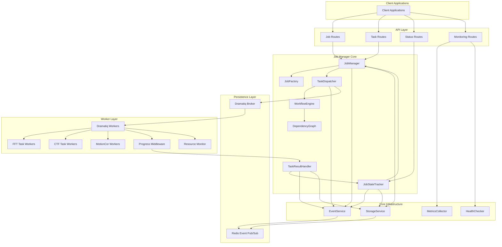
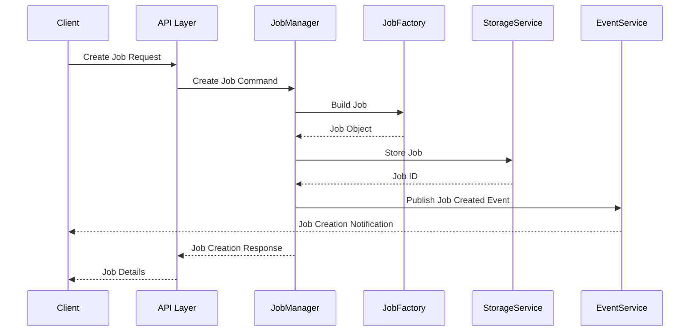
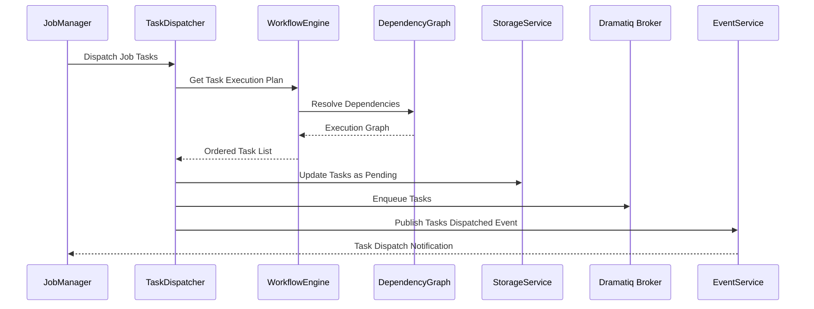
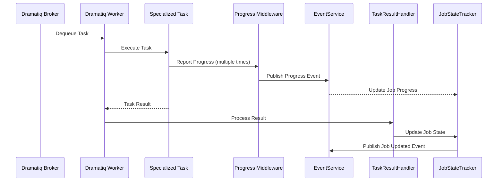

# JobManager Architecture

A comprehensive framework for managing microscopy data import jobs with progress tracking, dependency management, and scalable execution.

## Overview

The JobManager serves as a central hub for orchestrating complex data processing workflows in microscopy data management. It integrates Redis for unified storage, implements an event-first architecture, and leverages Dramatiq for reliable task processing.

## Architecture

The system is built with a modular approach, separating concerns between job management, task execution, and infrastructure services.



## Core Components

### Job Management

- **JobManager**: Central orchestration point for job lifecycle
- **JobFactory**: Creates jobs from specifications
- **JobStateTracker**: Tracks job state transitions
- **TaskDispatcher**: Sends tasks to Dramatiq broker
- **TaskResultHandler**: Processes task completion/failure
- **WorkflowEngine**: Manages task dependencies and execution order

### Task Processing

- **Dramatiq Broker**: Message broker for reliable task queueing
- **Dramatiq Workers**: Process tasks in background
- **Progress Middleware**: Tracks and reports task progress
- **Resource Monitor**: Tracks system resource availability

### Infrastructure Services

- **StorageService**: Unified Redis-based persistence layer
- **EventService**: Implements event-driven architecture
- **MetricsCollector**: Gathers performance metrics
- **HealthChecker**: Monitors system health

## File Structure

```
job_manager/
│
├── core/
│   ├── __init__.py
│   ├── storage/
│   │   ├── __init__.py
│   │   ├── redis_service.py            # Unified Redis storage implementation
│   │   ├── job_repository.py           # Job-specific data operations
│   │   ├── task_repository.py          # Task-specific data operations
│   │   └── serialization.py            # Data serialization helpers
│   │
│   ├── events/
│   │   ├── __init__.py
│   │   ├── event_service.py            # Event publishing and subscription
│   │   ├── event_types.py              # Event type definitions
│   │   └── event_handlers.py           # Default event handlers
│   │
│   ├── dramatiq/
│   │   ├── __init__.py
│   │   ├── broker_config.py            # Dramatiq broker configuration
│   │   ├── worker_registry.py          # Dramatiq worker registration
│   │   └── middleware/
│   │       ├── __init__.py
│   │       ├── progress_middleware.py   # Progress reporting middleware
│   │       └── resource_middleware.py   # Resource management middleware
│   │
│   └── monitoring/
│       ├── __init__.py
│       ├── metrics_collector.py        # System metrics collection
│       ├── health_checker.py           # System health monitoring
│       └── logging_config.py           # Logging configuration
│
├── job_manager/
│   ├── __init__.py
│   ├── job_manager.py                  # Main JobManager implementation
│   ├── job_factory.py                  # Creates jobs from specifications
│   ├── job_state_tracker.py            # Tracks job state transitions
│   ├── task_dispatcher.py              # Dispatches tasks to Dramatiq
│   ├── task_result_handler.py          # Processes task results
│   └── workflow_engine.py              # Manages task dependencies
│
├── models/
│   ├── __init__.py
│   ├── base_models.py                  # Base data models
│   ├── job_models.py                   # Job-specific models
│   ├── task_models.py                  # Task base models
│   └── specialized/
│       ├── __init__.py
│       ├── fft_models.py               # FFT-specific models
│       ├── ctf_models.py               # CTF-specific models
│       └── motioncor_models.py         # MotionCor-specific models
│
├── tasks/
│   ├── __init__.py
│   ├── base_task.py                    # Base task implementation
│   ├── progress_reporter.py            # Progress reporting utils
│   └── specialized/
│       ├── __init__.py
│       ├── fft_tasks.py                # FFT task implementations
│       ├── ctf_tasks.py                # CTF task implementations
│       └── motioncor_tasks.py          # MotionCor task implementations
│
├── api/
│   ├── __init__.py
│   ├── routes.py                       # API routes
│   ├── schemas.py                      # API request/response schemas
│   └── controllers.py                  # API controllers
│
├── integrations/
│   ├── __init__.py
│   ├── epu_adapter.py                  # EPU importer integration
│   ├── leginon_adapter.py              # Leginon importer integration
│   └── serialem_adapter.py             # SerialEM importer integration
│
├── utils/
│   ├── __init__.py
│   ├── configuration.py                # Configuration management
│   ├── dependency_graph.py             # Task dependency utilities
│   └── resource_monitor.py             # System resource monitoring
│
├── workers/
│   ├── __init__.py
│   ├── worker.py                       # Dramatiq worker entry point
│   └── worker_config.py                # Worker configuration
│
└── main.py                             # Application entry point
```

## Integration Flows

### Job Creation Flow



### Task Dispatch Flow



### Task Execution Flow



## Getting Started

### Prerequisites

- Python 3.8+
- Redis 6.0+
- RabbitMQ (optional, for high-throughput environments)

### Installation

```bash
# Clone the repository
git clone https://github.com/yourusername/job-manager.git
cd job-manager

# Create and activate virtual environment
python -m venv venv
source venv/bin/activate  # On Windows: venv\Scripts\activate

# Install dependencies
pip install -r requirements.txt

# Configure environment
cp .env.example .env
# Edit .env with your configuration

# Run the application
python main.py
```

### Starting Workers

```bash
# Start workers (in a separate terminal)
python -m workers.worker
```

## Usage Example

### Creating a Job

```python
from job_manager import JobManager
from models.job_models import JobSpecification

# Initialize JobManager
job_manager = JobManager()

# Create a job specification
job_spec = JobSpecification(
    name="EPU Import Job",
    description="Import microscopy data from EPU format",
    metadata={
        "source_directory": "/path/to/epu/data",
        "target_directory": "/path/to/output"
    }
)

# Create and start the job
job_id = job_manager.create_job(job_spec)
job_manager.start_job(job_id)

# Get job status
job_status = job_manager.get_job_status(job_id)
print(f"Job status: {job_status}")
```

## Contributing

1. Fork the repository
2. Create your feature branch (`git checkout -b feature/your-feature`)
3. Commit your changes (`git commit -am 'Add some feature'`)
4. Push to the branch (`git push origin feature/your-feature`)
5. Create a new Pull Request

## License

This project is licensed under the MIT License - see the LICENSE file for details.
