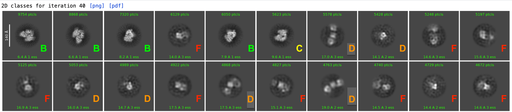

# 2D Class Average Manual Labelling for Training Data
## Instructions For Labeling Data

**All participating labelers should try to label all of the images from all labs (the target is 10,000 total)**.

This Markdown file will guide you on using the interactive GUI, `tkteach.py`, to easily assign labels to 2D class images that were extracted using `extract_mrc.py`. 

The `tkteach.py` program was modified from the original program written by [rmones](https://github.com/rmones/tkteach) under the Apache License 2.0.

## Steps

1. On the shared OneDrive, in a terminal shell, navigate to this folder (`ClassAvgLabeling`). Be sure to have your Anaconda environment active if necessary.
2. To begin manually labeling your data, run `tkteach.py` with Python. Please pass in the following command line arguments:
    - `--directory`: The lab's home folder (something like `/path/to/LanderLab/`) that contains the folders `images` and `metadata` that you would like to label.
    - `--email`: Your organizational email. This is used to uniquely identify labelers.
    
    This program will create a pop-up GUI for you to quickly select folders containing images and manually assign them scores.
    
    **Make sure you have X11 forwarding set up** on your machine or the program will crash, since tkteach uses a graphical display.

    Example:
    
        python tkteach.py --directory /path/to/MyLabFolder/ --email khom@scripps.edu

3. Each "dataset" on the left-hand side represents one 2D class job. Select a dataset on the left, then click **'Load Data Set'**. Each 2D class averaging job represents one dataset.

    For each image, you may assign it a score by either:
    - Clicking on the category on the right-hand side, or
    - Typing the corresponding key (A, B, C, D, or F)

    Please try to keep a consistent grading scheme. Click 'Save and Next' to move to the next image in the dataset.

Here are some example images and labels (provided by Michael Cianfrocco)

## Tips for using tkteach
- **Be careful not to assign multiple categories to one image, since tkteach will allow you to do this**
- Full-screen the window or zoom in/out on the images to fit your screen size.
- You can close tkteach at any time and it will save your answers for you. **Make sure to provide the same `--email` whenever you open tkteach again.**

