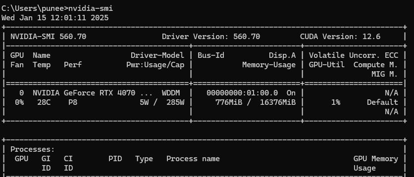
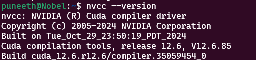

# MotionCor2 Setup and Usage Guide

**MotionCor2** is a high-performance program for drift correction of cryo-EM movie frames. This guide will help you set up **MotionCor2** locally on your system, run the software for motion correction, and troubleshoot common issues.

---

## Table of Contents

1. [Prerequisites](#prerequisites)
2. [Installation](#installation)
3. [Setting Up the Environment](#setting-up-the-environment)
4. [Running MotionCor2](#running-motioncor2)
5. [Run MotionCor Plugin](#run-motioncor-plugin)
6. [Results](#results)
7. [Installtion with Docker](#installation-with-docker)


---

## Prerequisites

Before you begin, ensure you have the following:

### 1. NVIDIA GPU:
   - MotionCor2 requires an **NVIDIA GPU** for GPU acceleration.
   - Ensure that your system has a supported **CUDA-compatible GPU**.

### 2. Software Dependencies:
   - Ensure that you have **gcc**, **g++**, and **make** installed for compiling and running CUDA programs.

### 3. MotionCor2 Software:
   - Download the MotionCor2 binaries **MotionCor2_1.6.4_Cuda121_Mar312023**. The program is available from the  official site, and it typically comes as a compressed file. [motioncor download page](https://emcore.ucsf.edu/ucsf-software)

## Installation

### 1. Download Motioncor2
   - Obtain the MotionCor2 binaries from the official release page.
   - place the file in the root of the project **Magellon/plugins/magellon_motioncor_plugin/MotionCor2_1.6.4_Cuda121_Mar312023**

### 2. Installation steps to run motioncor locally and on docker

you can check for Support matrix between GPU, CUDA toolkit and CUDA driver Requirements here [Support Matrix](https://docs.nvidia.com/deeplearning/cudnn/latest/reference/support-matrix.html#cudnn-cuda-hardware-versions)

## Installation on Windows

**Check out the overall installation process and each installation step below:**

- Install Docker Desktop, enable WSL, install Ubuntu, configure Docker Desktop, and install the Nvidia driver on Windows.
- Install CUDA Toolkit, cuDNN, and Nvidia Container Toolkit on Ubuntu (Linux).


1. **Install Docker Desktop**
   - Download and install Docker Desktop from the official Docker website.

2. **Install WSL and Enable WSL2**
   - Open PowerShell as Administrator and run:
     ```bash
     wsl --install
     ```
   - Ensure WSL2 is enabled:
     ```bash
     wsl --set-default-version 2
     ```

3. **Install Ubuntu 22.04**
   - Install Ubuntu 22.04 from the Microsoft Store.

4. **Configure Docker Desktop**
   - Open Docker Desktop and navigate to **Settings > Resources > WSL Integration**.
   - Enable integration for WSL2 and your Ubuntu distribution.

5. **Install NVIDIA Drivers**
   - Search for drivers on the NVIDIA website.[Nvidi driver Installation link](https://www.nvidia.com/en-us/drivers/) Select a driver with CUDA 12.6 support. you need to select windows version as the driver is installed on the host machine i.e windows.
   - For NVIDIA GeForce 4700 series, install the Game Ready Driver (e.g., version 560.7).
   - Test the installation by running:
     ```bash
     nvidia-smi
     ```
     Ensure the driver and CUDA version are displayed.
     

6. **Install CUDA Toolkit 12.6.3**
   - Install CUDA Toolkit 12.6.3 on Ubuntu so you need to choose i.e wsl-ubuntu version. [cuda toolkit Installation link](https://developer.nvidia.com/cuda-12-6-3-download-archive) Verify installation with:
     ```bash
     nvcc --version
     ```
     
   - If CUDA is installed but not recognized, add it to your PATH.

   - Add the following to your **~/.bashrc** file:
   ```bash
   if [ -d $HOME/.local/bin ]; then
    export PATH=$HOME/.local/bin:$PATH
   fi

   export CUDA_HOME=/usr/local/cuda

   if [ -d $CUDA_HOME/bin ]; then
      export PATH=$CUDA_HOME/bin:$PATH
   fi

   if [ -d $CUDA_HOME/lib64 ]; then
      export LD_LIBRARY_PATH=$CUDA_HOME/lib64:$LD_LIBRARY_PATH
   fi
   ```
   - Restart your terminal or run:
   ```bash
   source ~/.bashrc
   ```

7. **Install cuDNN 9.6**
   - Download the cuDNN tar file.
   - Extract the files and copy them to the CUDA Toolkit directory.
   [CuDNN Download](https://developer.nvidia.com/cudnn-downloads?target_os=Linux&target_arch=x86_64&Distribution=Agnostic&cuda_version=12)

   - extract the file
   ```bash
   tar -xvf cudnn-linux-x86_64-9.6.0.74_cuda12-archive.tar.xz
   ```
   - Copy the cuDNN files to the CUDA directory:
   ```bash
   sudo cp cuda-*-archive/include/cudnn*.h /usr/local/cuda/include
   sudo cp -P cudnn-*-archive/lib/libcudnn* /usr/local/cuda/lib64
   sudo chmod a+r /usr/local/cuda/include/cudnn*.h /usr/local/cuda/lib64/libcudnn*
   ```
8. **Install NVIDIA Container Toolkit to run on docker**
   - Install the NVIDIA Container Toolkit to enable GPU support in Docker. [Nvidia container toolkit Installation link](https://docs.nvidia.com/datacenter/cloud-native/container-toolkit/latest/install-guide.html)
   - configure the container toolkit [toolkit Configuration](https://docs.nvidia.com/datacenter/cloud-native/container-toolkit/latest/install-guide.html#configuration)

9. **Dockerize and Test the Application**
   - Follow the Docker steps mentioned earlier to build and run the application.

---

## Installation on Linux

1. **Install Docker**
   - Install Docker using your distribution’s package manager. For example, on Ubuntu:
     ```bash
     sudo apt update
     sudo apt install docker.io
     ```

2. **Install NVIDIA Drivers**
   - Install the latest NVIDIA drivers with CUDA 12.6 support. Verify installation with:
     ```bash
     nvidia-smi
     ```

3. **Install CUDA Toolkit 12.6.3**
   - Download and install CUDA Toolkit 12.6.3. Add it to your PATH if required and verify:
     ```bash
     nvcc --version
     ```

4. **Install cuDNN 9.6**
   - Download and extract the cuDNN tar file. Copy the files to the appropriate CUDA Toolkit directories.

5. **Install NVIDIA Container Toolkit**
   - Install NVIDIA Container Toolkit to enable GPU access in Docker.

6. **Build and Run the Application**
   - Follow the steps mentioned earlier to build and test the Docker application.

---

**Note:**

If the CUDA driver version is 12.7, it should theoretically support all 12.x versions, including 12.6, as long as the APIs used have not changed between versions. However, to be on the safe side, we are opting for a driver that explicitly supports CUDA 12.6. The compatibility matrix for API changes between versions is not officially documented, making it difficult to confirm compatibility in advance. If this understanding is incorrect, I would be glad to learn otherwise.

I followed the instructions from the GitHub link provided below for the CUDA installation on WSL2 with Ubuntu. If you have any doubts, you can refer to it: [cuda-wsl2-ubuntu installtion](https://gist.github.com/Ayke/5f37ebdb84c758f57d7a3c8b847648bb)


## Running MotionCor2
Once your environment is set up, you can run MotionCor2 using the following command:

```bash
/path/to/MotionCor2_1.6.4_Cuda121_Mar312023 -InTiff /path/to/input_movie.tif -OutMrc /path/to/output_movie.mrc -Gain /path/to/gain_reference.tif 
```


## Run MotionCor Plugin locally

### 1. Run the rabbitMq
   - Make sure the docker is installed. Go to **support** folder in project and run the docker-compose file.

```bash
    docker-compose up
```

### 2. Create a Virtual environment
   - Ensure **conda** is installed on your machine.
   - Create a new conda environment
   ```bash
   conda create -n <environment-name>
   ```
   - Activate the environment
   ```bash
   conda activate <environment-name>
   ```

### 3. Check **build_motioncor3_command** in **utils.py** 
- If you need additional arguments to be supported you can uncomment the arguments or change them accordingly.
### 4. Steps to Run the Project
 - Install the project dependencies:
    ```bash
    pip install -r requirements.txt
    ```
 - Start the development server:
 ```bash
 uvicorn main:app --reload --port 8001
 ```

### 5.Run the test_publish.py file

 ```
 python3 test_publish.py
 ```

 - ensure check the path of the inputfile and gain file in the code.


 ## Results
  - **Five** files will be created in outputs folder inside gpfs with a unique **UUID**
    - <inputfilename>-Patch_Frame.log
    - <inputfilename>-Patch-Full.log
    - <inputfilename>-Patch-Patch.log
    - <outputfilename>_DW.mrc
    - <outputfilenamee>.mrc    


   


## Installation with Docker

### 1. Run RabbitMQ
- Ensure Docker is installed. Navigate to the **support** folder in the project and run the `docker-compose` file.

```bash
    docker-compose up
```

### 2. Build the Image
- Navigate to the root of the motioncor plugin project where the **Dockerfile** is located.
- Ensure you have copied the necessary files (e.g., movie file, Gain file) into the directory. Add these files to the `Dockerfile` as shown:

```dockerfile
COPY 20241202_53597_gain_multi_ref.tif ./20241202_53597_gain_multi_ref.tif
COPY 20241203_54449_integrated_movie.mrc.tif ./20241203_54449_integrated_movie.mrc.tif
```

#### Steps to Build and Run

1. **Build the Image**
   ```bash
   docker build --tag motioncor .
   ```

2. **Run the Container**
   ```bash
   docker run --gpus all motioncor
   docker run --name magellon-motioncor-container --gpus all --restart always magellon_motioncor_plugin_image
docker run --name magellon-motioncor-container --gpus all --restart always -v /gpfs:/temp/motioncor magellon_motioncor_plugin_image

   ```

3. **Run the Test File**
   - Enter the container's bash shell:
     ```bash
     docker ps
     ```
   - Copy the container ID and run:
     ```bash
     docker exec -it <containerid> /bin/bash
     ```
   - Inside the container, execute the test script:
     ```bash
     python3 test_publish.py
     ```

---
